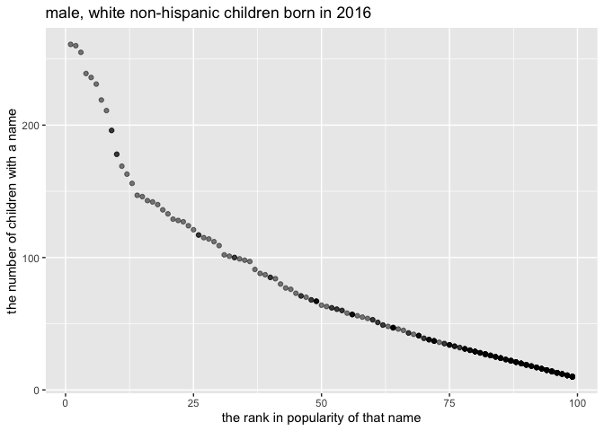

p8105\_hw2\_zh2494
================
zhuolun
10/5/2021

# question 1

``` r
trash_df = 
  read_excel("data/Trash-Wheel-Collection-Totals-8-6-19.xlsx",range = "A2:N408") %>%
  janitor::clean_names() %>% 
  drop_na(dumpster) %>%
  mutate(sports_balls = round(as.numeric(sports_balls),digits = 0))
view(trash_df)

trash_df_19 =
  read_excel("data/Trash-Wheel-Collection-Totals-8-6-19.xlsx",range = "A2:B14",4) %>%
  janitor::clean_names() %>%
  drop_na(total) %>%
  mutate(Year = "2019")
view(trash_df_19)

trash_df_18 =
  read_excel("data/Trash-Wheel-Collection-Totals-8-6-19.xlsx",range = "A2:B14",5) %>% 
  janitor::clean_names() %>%
  mutate(Year = "2018")
view(trash_df_18)

trash_df_18_19 = 
  bind_rows(trash_df_18,trash_df_19) %>% 
  janitor::clean_names() %>%
  mutate(month = month.name[month]) %>% 
  select("year","month",everything())
view(trash_df_18_19)

skimr::skim(trash_df)
```

|                                                  |           |
|:-------------------------------------------------|:----------|
| Name                                             | trash\_df |
| Number of rows                                   | 344       |
| Number of columns                                | 14        |
| \_\_\_\_\_\_\_\_\_\_\_\_\_\_\_\_\_\_\_\_\_\_\_   |           |
| Column type frequency:                           |           |
| character                                        | 1         |
| numeric                                          | 12        |
| POSIXct                                          | 1         |
| \_\_\_\_\_\_\_\_\_\_\_\_\_\_\_\_\_\_\_\_\_\_\_\_ |           |
| Group variables                                  | None      |

Data summary

**Variable type: character**

| skim\_variable | n\_missing | complete\_rate | min | max | empty | n\_unique | whitespace |
|:---------------|-----------:|---------------:|----:|----:|------:|----------:|-----------:|
| month          |          0 |              1 |   3 |   9 |     0 |        12 |          0 |

**Variable type: numeric**

| skim\_variable       | n\_missing | complete\_rate |     mean |       sd |      p0 |     p25 |      p50 |      p75 |      p100 | hist  |
|:---------------------|-----------:|---------------:|---------:|---------:|--------:|--------:|---------:|---------:|----------:|:------|
| dumpster             |          0 |              1 |   172.50 |    99.45 |    1.00 |   86.75 |   172.50 |   258.25 |    344.00 | ▇▇▇▇▇ |
| year                 |          0 |              1 |  2016.50 |     1.58 | 2014.00 | 2015.00 |  2017.00 |  2018.00 |   2019.00 | ▇▃▃▆▂ |
| weight\_tons         |          0 |              1 |     3.26 |     0.75 |    0.96 |    2.76 |     3.26 |     3.77 |      5.62 | ▁▅▇▅▁ |
| volume\_cubic\_yards |          0 |              1 |    15.54 |     1.68 |    7.00 |   15.00 |    15.00 |    16.00 |     20.00 | ▁▁▁▇▂ |
| plastic\_bottles     |          0 |              1 |  1873.15 |  1028.87 |  210.00 |  957.50 |  1835.00 |  2552.50 |   5960.00 | ▇▆▅▁▁ |
| polystyrene          |          0 |              1 |  2138.68 |  1202.82 |  320.00 | 1065.00 |  2075.00 |  3120.00 |   6540.00 | ▇▆▅▁▁ |
| cigarette\_butts     |          0 |              1 | 30754.13 | 34492.50 |  980.00 | 7000.00 | 19000.00 | 38000.00 | 310000.00 | ▇▁▁▁▁ |
| glass\_bottles       |          0 |              1 |    25.36 |    18.64 |    0.00 |   10.00 |    21.50 |    38.00 |    110.00 | ▇▅▂▁▁ |
| grocery\_bags        |          0 |              1 |  1311.23 |   881.87 |   50.00 |  600.00 |  1050.00 |  1912.50 |   3750.00 | ▇▇▅▃▁ |
| chip\_bags           |          0 |              1 |  1780.27 |   956.53 |  230.00 |  977.50 |  1630.00 |  2490.00 |   5085.00 | ▇▇▅▂▁ |
| sports\_balls        |          0 |              1 |    11.81 |     9.81 |    0.00 |    5.00 |     8.00 |    16.00 |     56.00 | ▇▃▁▁▁ |
| homes\_powered       |          0 |              1 |    43.83 |    23.98 |    0.00 |   35.62 |    51.42 |    59.50 |     93.67 | ▅▂▇▆▁ |

**Variable type: POSIXct**

| skim\_variable | n\_missing | complete\_rate | min        | max        | median     | n\_unique |
|:---------------|-----------:|---------------:|:-----------|:-----------|:-----------|----------:|
| date           |          0 |              1 | 2014-05-16 | 2019-06-17 | 2017-03-31 |       217 |

``` r
names(trash_df)
```

    ##  [1] "dumpster"           "month"              "year"              
    ##  [4] "date"               "weight_tons"        "volume_cubic_yards"
    ##  [7] "plastic_bottles"    "polystyrene"        "cigarette_butts"   
    ## [10] "glass_bottles"      "grocery_bags"       "chip_bags"         
    ## [13] "sports_balls"       "homes_powered"

the total precipitation in 2018 is 70.33,the median number of sports
balls in a dumpster in 2019 is 8.5

# question 2

``` r
pols_month = 
  read_csv("./fivethirtyeight_datasets/pols-month.csv") %>% 
  janitor::clean_names() %>% 
  mutate(mon = as.Date(mon, format = "%m/%d/%y")) %>% 
  separate(mon, c("year","month","day")) %>% 
  mutate(
    month = month.name[as.numeric(month)],
    president = ifelse(prez_gop == 1, "gop", ifelse(prez_dem == 1, "dem",0)),
    year = as.numeric(year)) %>% 
  select(-"prez_gop",-"prez_dem",-"day")
```

    ## Rows: 822 Columns: 9

    ## ── Column specification ────────────────────────────────────────────────────────
    ## Delimiter: ","
    ## dbl  (8): prez_gop, gov_gop, sen_gop, rep_gop, prez_dem, gov_dem, sen_dem, r...
    ## date (1): mon

    ## 
    ## ℹ Use `spec()` to retrieve the full column specification for this data.
    ## ℹ Specify the column types or set `show_col_types = FALSE` to quiet this message.

``` r
view(pols_month)

snp = 
  read_csv("./fivethirtyeight_datasets/snp.csv") %>%
  janitor::clean_names() %>% 
  mutate(
    date = as.Date(date, format = "%m/%d/%y")) %>% 
  separate(date, c("year","month","day")) %>% 
  mutate(
    month = month.name[as.numeric(month)],
    day = NULL) %>% 
  select("year","month",everything())
```

    ## Rows: 787 Columns: 2

    ## ── Column specification ────────────────────────────────────────────────────────
    ## Delimiter: ","
    ## chr (1): date
    ## dbl (1): close

    ## 
    ## ℹ Use `spec()` to retrieve the full column specification for this data.
    ## ℹ Specify the column types or set `show_col_types = FALSE` to quiet this message.

``` r
snp$year = as.numeric(snp$year)
snp$year = ifelse(snp$year >= 2050, snp$year - 100, snp$year)
view(snp)

unemployment = 
  read_csv("./fivethirtyeight_datasets/unemployment.csv") %>% 
  janitor::clean_names() %>% 
  pivot_longer(
    jan:dec,
    names_to = "month",
    values_to = "value") %>% 
  mutate(
    month = str_to_title(month),
    month = month.name[match(month,month.abb)]
    )
```

    ## Rows: 68 Columns: 13

    ## ── Column specification ────────────────────────────────────────────────────────
    ## Delimiter: ","
    ## dbl (13): Year, Jan, Feb, Mar, Apr, May, Jun, Jul, Aug, Sep, Oct, Nov, Dec

    ## 
    ## ℹ Use `spec()` to retrieve the full column specification for this data.
    ## ℹ Specify the column types or set `show_col_types = FALSE` to quiet this message.

``` r
view(unemployment)

pols_month_snp =
  left_join(pols_month,snp,by = c("year","month"))

final_df = 
  left_join(pols_month_snp,unemployment,by = c("year","month"))

skimr::skim(final_df)
```

|                                                  |           |
|:-------------------------------------------------|:----------|
| Name                                             | final\_df |
| Number of rows                                   | 822       |
| Number of columns                                | 11        |
| \_\_\_\_\_\_\_\_\_\_\_\_\_\_\_\_\_\_\_\_\_\_\_   |           |
| Column type frequency:                           |           |
| character                                        | 2         |
| numeric                                          | 9         |
| \_\_\_\_\_\_\_\_\_\_\_\_\_\_\_\_\_\_\_\_\_\_\_\_ |           |
| Group variables                                  | None      |

Data summary

**Variable type: character**

| skim\_variable | n\_missing | complete\_rate | min | max | empty | n\_unique | whitespace |
|:---------------|-----------:|---------------:|----:|----:|------:|----------:|-----------:|
| month          |          0 |              1 |   3 |   9 |     0 |        12 |          0 |
| president      |          0 |              1 |   1 |   3 |     0 |         3 |          0 |

**Variable type: numeric**

| skim\_variable | n\_missing | complete\_rate |    mean |     sd |      p0 |     p25 |     p50 |     p75 |    p100 | hist  |
|:---------------|-----------:|---------------:|--------:|-------:|--------:|--------:|--------:|--------:|--------:|:------|
| year           |          0 |           1.00 | 1980.75 |  19.79 | 1947.00 | 1964.00 | 1981.00 | 1998.00 | 2015.00 | ▇▇▇▇▇ |
| gov\_gop       |          0 |           1.00 |   22.48 |   5.68 |   12.00 |   18.00 |   22.00 |   28.00 |   34.00 | ▆▆▇▅▅ |
| sen\_gop       |          0 |           1.00 |   46.10 |   6.38 |   32.00 |   42.00 |   46.00 |   51.00 |   56.00 | ▃▃▇▇▇ |
| rep\_gop       |          0 |           1.00 |  194.92 |  29.24 |  141.00 |  176.00 |  195.00 |  222.00 |  253.00 | ▃▇▆▃▅ |
| gov\_dem       |          0 |           1.00 |   27.20 |   5.94 |   17.00 |   22.00 |   28.00 |   32.00 |   41.00 | ▆▅▇▆▂ |
| sen\_dem       |          0 |           1.00 |   54.41 |   7.37 |   44.00 |   48.00 |   53.00 |   58.00 |   71.00 | ▇▆▇▃▂ |
| rep\_dem       |          0 |           1.00 |  244.97 |  31.37 |  188.00 |  211.00 |  250.00 |  268.00 |  301.00 | ▇▂▇▇▅ |
| close          |         36 |           0.96 |  472.85 | 543.29 |   17.05 |   83.67 |  137.26 |  932.06 | 2107.39 | ▇▁▂▁▁ |
| value          |         12 |           0.99 |    5.83 |   1.65 |    2.50 |    4.70 |    5.60 |    6.90 |   10.80 | ▃▇▅▂▁ |

``` r
summary(final_df)
```

    ##       year         month              gov_gop         sen_gop    
    ##  Min.   :1947   Length:822         Min.   :12.00   Min.   :32.0  
    ##  1st Qu.:1964   Class :character   1st Qu.:18.00   1st Qu.:42.0  
    ##  Median :1981   Mode  :character   Median :22.00   Median :46.0  
    ##  Mean   :1981                      Mean   :22.48   Mean   :46.1  
    ##  3rd Qu.:1998                      3rd Qu.:28.00   3rd Qu.:51.0  
    ##  Max.   :2015                      Max.   :34.00   Max.   :56.0  
    ##                                                                  
    ##     rep_gop         gov_dem        sen_dem         rep_dem   
    ##  Min.   :141.0   Min.   :17.0   Min.   :44.00   Min.   :188  
    ##  1st Qu.:176.0   1st Qu.:22.0   1st Qu.:48.00   1st Qu.:211  
    ##  Median :195.0   Median :28.0   Median :53.00   Median :250  
    ##  Mean   :194.9   Mean   :27.2   Mean   :54.41   Mean   :245  
    ##  3rd Qu.:222.0   3rd Qu.:32.0   3rd Qu.:58.00   3rd Qu.:268  
    ##  Max.   :253.0   Max.   :41.0   Max.   :71.00   Max.   :301  
    ##                                                              
    ##   president             close             value      
    ##  Length:822         Min.   :  17.05   Min.   : 2.50  
    ##  Class :character   1st Qu.:  83.67   1st Qu.: 4.70  
    ##  Mode  :character   Median : 137.26   Median : 5.60  
    ##                     Mean   : 472.85   Mean   : 5.83  
    ##                     3rd Qu.: 932.06   3rd Qu.: 6.90  
    ##                     Max.   :2107.39   Max.   :10.80  
    ##                     NA's   :36        NA's   :12

# question 3

``` r
Baby = 
  read_csv("data/Popular_Baby_Names.csv") %>% 
  janitor::clean_names() %>%
  mutate(
    gender = str_to_lower(gender),
    childs_first_name = str_to_title(childs_first_name),
    ethnicity = recode(ethnicity, `ASIAN AND PACI` = "asian and pacific islander",
                       `ASIAN AND PACIFIC ISLANDER` = "asian and pacific islander",
                       `HISPANIC` = "hispanic",
                       `WHITE NON HISP` = "white non hispanic",
                       `WHITE NON HISPANIC` = "white non hispanic",
                       `BLACK NON HISPANIC` = "black non hispanic",
                       `BLACK NON HISP` = "black non hispanic")) %>%
  distinct()
```

    ## Rows: 19418 Columns: 6

    ## ── Column specification ────────────────────────────────────────────────────────
    ## Delimiter: ","
    ## chr (3): Gender, Ethnicity, Child's First Name
    ## dbl (3): Year of Birth, Count, Rank

    ## 
    ## ℹ Use `spec()` to retrieve the full column specification for this data.
    ## ℹ Specify the column types or set `show_col_types = FALSE` to quiet this message.

``` r
Olivia =
  Baby %>% 
  filter(childs_first_name == "Olivia") %>% 
  select(-gender,-count,-childs_first_name) %>% 
  pivot_wider(
    names_from = "year_of_birth",
    values_from = "rank")
view(Olivia)

most_name = 
  Baby %>% 
  filter(gender == "male",rank == "1") %>% 
  select(-gender,-count,-rank) %>% 
  pivot_wider(
    names_from = "year_of_birth",
    values_from = "childs_first_name"
  )

head(most_name) %>% knitr::kable()
```

| ethnicity                  | 2016   | 2015   | 2014   | 2013   | 2012   | 2011    |
|:---------------------------|:-------|:-------|:-------|:-------|:-------|:--------|
| asian and pacific islander | Ethan  | Jayden | Jayden | Jayden | Ryan   | Ethan   |
| black non hispanic         | Noah   | Noah   | Ethan  | Ethan  | Jayden | Jayden  |
| hispanic                   | Liam   | Liam   | Liam   | Jayden | Jayden | Jayden  |
| white non hispanic         | Joseph | David  | Joseph | David  | Joseph | Michael |

``` r
finall_plot =
  Baby %>%
  filter(gender == "male",year_of_birth == "2016",ethnicity == "white non hispanic")
view(finall_plot)

ggplot(finall_plot, aes(x = rank, y = count)) + geom_point(alpha = 0.5) + labs(x = "the rank in popularity of that name", y = "the number of children with a name", title = "male, white non-hispanic children born in 2016")
```

<!-- -->
